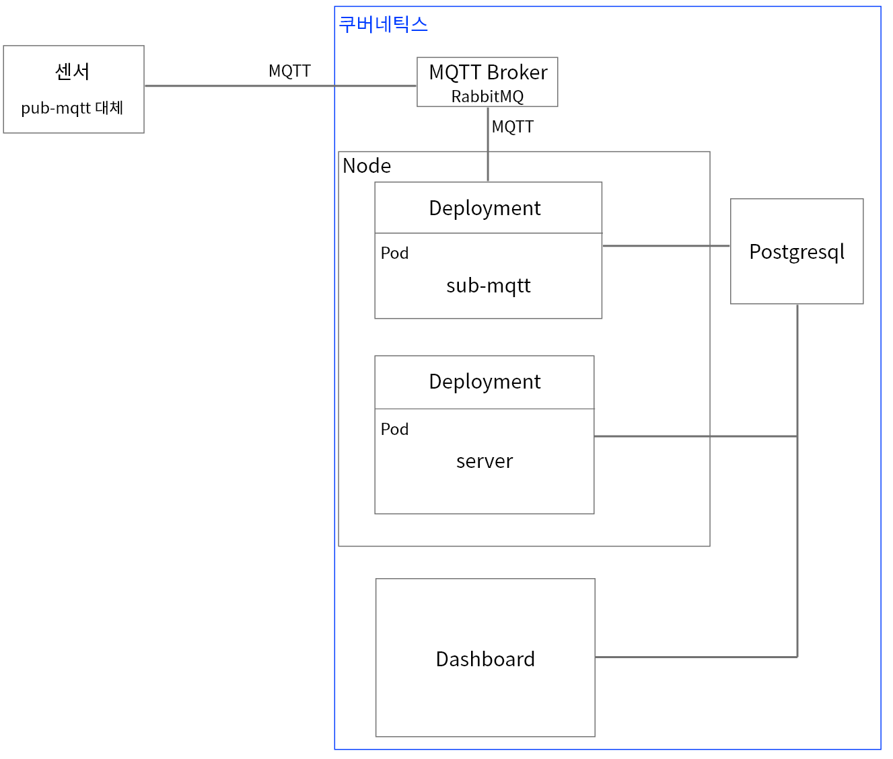
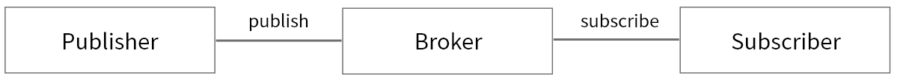
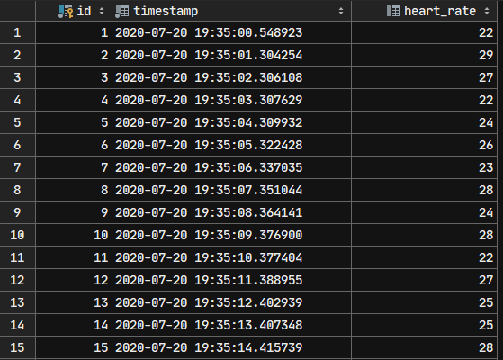

# 원격 태아 검사 IoT 시스템

## 시스템 구조

전체적인 구조의 모습은 아래 그림에서 확인할 수 있다.

### 센서

실제로는 센서를 통해 태아의 심장 박동과 태동을 센서로 측정하는 것이지만,
그렇다고 가정하고 데이터 생성 프로그램(pub-mqtt)을 사용하여 데이터를 생성한다.

### MQTT 통신

MQTT는 IoT를 위한 통신 프로토콜로 저전력, 낮은 패킷량으로 통신한다는 점이 특징이다.
MQTT는 일반적인 통신과는 다르게, 중간에 통신을 중계하는 브로커가 존재한다.

브로커에게 특정 topic에 대해 데이터를 보내면(publish),
브로커는 해당 topic을 구독하는(subscribe) 프로그램에게 데이터를 전송한다.
여기 시스템에서 브로커는 rabbitMQ가 담당하고, 
sub-mqtt 프로그램이 fetal-information이라는 topic에 대해 구독한다.

### sub-mqtt

sub-mqtt 프로그램은 브로커로부터 데이터를 받아 postgresql에 데이터를 저장한다.

### postgresql

postgresql은 데이터베이스로, 현재 할당받은 DB에 fetal_information라는 이름의 schema를 만들고
heart_rate라는 이름의 table을 만들어 데이터를 저장하였다. 
아래 캡쳐는 테이블에 저장된 데이터의 모습이다.

### server

server은 node.js express 프레임워크를 사용한 프로그램으로,
웹사이트를 개발할 수 있다.

### Dashboard

postgresql에서 데이터를 받아 데이터를 시각화한다.